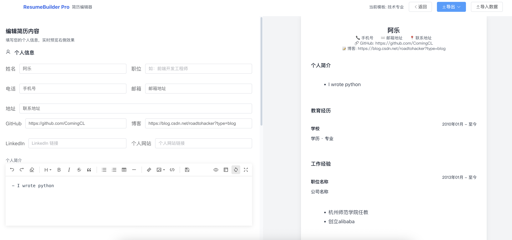

# 🚀 ResumeBuilder Pro - 简历生成器

<div align="center">


**🎯 现代化 · 专业级简历生成解决方案**

</div>

## 效果展示

### 特色
- 无需后端，前端编辑，可保存为json，下次使用时可导入
- 可导出为pdf文件，且分页时，内容不会被分割
## 🚀 快速开始

### 环境要求
- Node.js >= 16.0.0
- npm >= 8.0.0 或 pnpm >= 7.0.0

### 安装与运行

```bash
# 克隆项目
git clone https://github.com/ComingCL/ResumeBuilder-Pro.git
cd ResumeBuilder-Pro

# 安装依赖
npm install
# 或使用 pnpm
pnpm install

# 启动开发服务器
npm run dev
# 或使用 pnpm
pnpm dev

# 构建生产版本
npm run build
# 或使用 pnpm
pnpm build
```

### 项目结构
```
ResumeBuilder-Pro/
├── src/
│   ├── components/          # 公共组件
│   │   ├── DatePickerWithCurrent.vue  # 自定义日期选择器
│   │   └── ...
│   ├── stores/              # Pinia状态管理
│   │   └── resume.js        # 简历数据状态
│   ├── views/               # 页面组件
│   │   ├── Editor.vue       # 编辑器页面
│   │   └── Preview.vue      # 预览页面
│   ├── utils/               # 工具函数
│   │   └── exportImport.js  # 导出导入工具
│   ├── styles/              # 样式文件
│   └── main.js              # 应用入口
├── public/                  # 静态资源
└── package.json            # 项目配置
```

---

## 🛠 技术栈

### 前端框架
- **Vue 3** - 渐进式JavaScript框架
- **Composition API** - Vue 3组合式API
- **Vue Router** - 官方路由管理器
- **Pinia** - 新一代状态管理库

### UI组件库
- **Element Plus** - 基于Vue 3的桌面端组件库
- **Element Plus Icons** - 官方图标库
- **UnoCSS** - 即时原子化CSS引擎

### 编辑器与渲染
- **@kangc/v-md-editor** - Vue Markdown编辑器
- **CodeMirror 6** - 代码编辑器核心
- **highlight.js** - 语法高亮库
- **markdown-it** - Markdown解析器

### 导出与工具
- **html2canvas** - HTML转Canvas库
- **jsPDF** - 客户端PDF生成
- **SortableJS** - 拖拽排序库
- **vuedraggable** - Vue拖拽组件

### 开发工具
- **Vite** - 下一代前端构建工具
- **TypeScript** - JavaScript超集
- **ESLint** - 代码质量检查
- **Prettier** - 代码格式化工具
- **Sass** - CSS预处理器

---
## 🔧 开发指南

### 代码规范
项目采用严格的代码规范：
- ESLint + Prettier 代码格式化
- TypeScript 类型检查
- Vue 3 Composition API 最佳实践
- 组件化开发模式

### 构建部署
```bash
# 构建生产版本
npm run build

# 预览构建结果
npm run preview

# 代码检查
npm run lint

# 代码格式化
npm run format
```

---
### 问题反馈
- 🐛 [报告Bug](https://github.com/ComingCL/ResumeBuilder-Pro/issues)
- 💡 [功能建议](https://github.com/ComingCL/ResumeBuilder-Pro/issues)
- 📖 [文档改进](https://github.com/ComingCL/ResumeBuilder-Pro/issues)

---